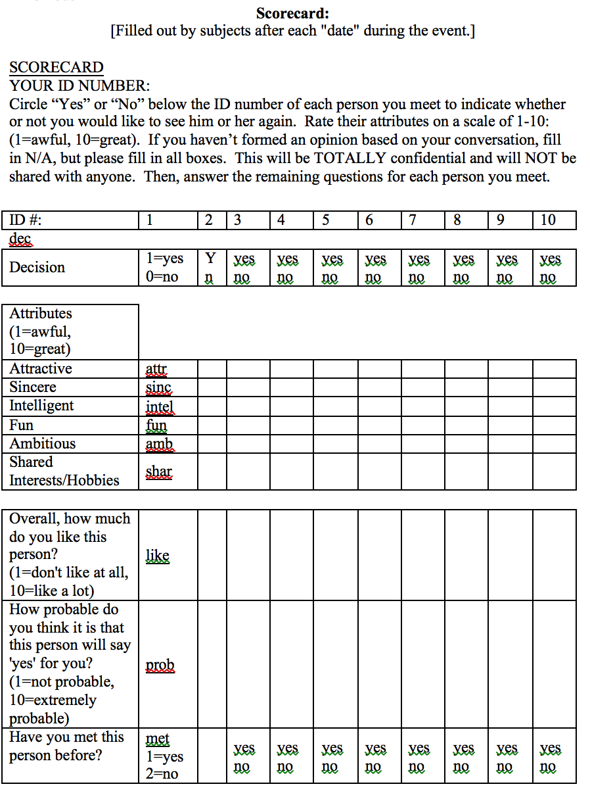

# Speed Dating Analysis
Analysis through linear and logistic regression on data from a speed dating experiment from Columbia Business School.

## The data
We have data describing 5000 4 minutes speed dates involving 310 american young adults. The original data were collected by Columbia Business professors

The participants had several 4 minutes dates by night. After each one, they filled forms evaluating those they had dated. Each row in the data represents one of these dates.

### The questions
What attracts at first sight? And how this changes on different genders? People of different backgrounds? What characteristics are more and less important for a man/woman to be noticed? 

### The variables

- iid : id of the participant p1 in the date
- gender : gender of p1, 0 = woman
- order : of the several dates in the night, this was the nth, according to this variable
- pid : id of participant p2
- int_corr : correlation between the interests of p1 and p2
- samerace : Are p1 and p2 of the same race?
- age_o : Age of p2
- age : Age of p1
- field : field of study of p1
- race : race of p1. The code is Black/African American=1; European/Caucasian-American=2; Latino/Hispanic American=3; Asian/Pacific Islander/Asian-American=4; Native American=5; Other=6
- from : from where p1 comes from
- career : what career p1 wants to follow
- sports, tvsports, exercise, dining, museums, art, hiking, gaming, clubbing, reading, tv, theater, movies, concerts, music, shopping, yoga : From 1 to 10, how interested p1 is in each one of these activities
- attr : how attractive p1 thinks p2 is
- sinc : how sincere  p1 thinks p2 is
- intel : how smart p1 thinks p2 is
- fun : how fun p1 thinks p2 is
- amb : how ambitious p1 thinks p2 is
- shar : how much p1 believes they both (p1 and p2) share the same interests and hobbies
- like : in general, how much does p1 likes p2?
- prob : how probable p1 thinks it's that p2 will want to meet again with p- (scale 1-10)
- attr3_s : how attractive p1 believes itself
- sinc3_s : how sincere p1 believes itself
- intel3_s : how smart p1 believes itself
- fun3_s : how fun p1 believes itself
- amb3_s : how ambitious p1 believes itself

### The form

Good part of the data comes from here:

## Prerequisites

* `R >= 3.3.3`

* tidyverse
* ggfortify
* gridExtra
* broom
* modelr
* GGally
* caret
* here
* ROCR
* pscl
* vcd

## Execution

The R notebooks reside in the *notebooks* directory, and ideally should be run under the Rstudio IDE.

## Authors

* **Benardi Nunes** - *Initial work* - [Benardi](https://github.com/Benardi)

## License

This project is licensed under the GPL v3 License - see the [LICENSE.md](LICENSE.md) file for details

